# Reconstructing an Entire Movie Song as a 3D World

*How we turned the Pinga song courtyard into a walkable 3D set — and all the things that broke along the way.*

---

## The source song — Pinga (*Bajirao Mastani*)

This whole project starts from one music video. If you haven't seen it (or need a refresher), here's the original:

<div style="margin: 16px 0;">
  <iframe width="100%" height="400" src="https://www.youtube.com/embed/tzRFLMn4kpM" title="Pinga — Bajirao Mastani" frameborder="0" allow="accelerometer; autoplay; clipboard-write; encrypted-media; gyroscope; picture-in-picture" allowfullscreen style="max-width: 720px; border-radius: 8px; aspect-ratio: 16/9;"></iframe>
  <p style="font-size: 0.85em; color: #666; margin-top: 8px;">
    <a href="https://www.youtube.com/watch?v=tzRFLMn4kpM">Watch on YouTube</a> — the courtyard set we reconstructed appears throughout this song.
  </p>
</div>

Watch for the hard cuts, close-ups on the performers, and how the camera never sits still long enough to give you a clean multi-view scan of the environment. **That's exactly the problem we're solving.**

---

## Quick context (read this first)

If you've seen **Pinga** from *Bajirao Mastani*, you'll remember the courtyard scene — stone arches, lanterns, a big tree, performers dancing. Beautiful on screen.

We wanted something ambitious: **rebuild that entire set in 3D** so you could move a virtual camera through it, not just stare at one photo.

Sounds straightforward? It's not. A movie song isn't a clean 360° capture. It's a **heavily edited music video** — hard cuts, close-ups on actors, camera shake, zooms, and shots where 80% of the frame is a person, not the set.

This blog walks through how we actually solved that for the Pinga courtyard, using **HY-World 2.0** (HunyuanWorld). Everything shown here comes from our [`pinga_set/`](../pinga_set/) output folder.

Pipeline code lives in [`code/`](code/) — HY-World stages in `code/stages/`, panorama generator in `code/panogen/`.

---

## The goal vs. what we actually have

**Goal:** One coherent 3D environment reconstructed from an entire song.

**What we actually have as input:** Hundreds of unrelated 2D frames, most of which are useless for geometry.

| What we need | What a song gives us |
|---|---|
| Overlapping views of the same walls | Hard cuts to a completely different angle |
| Static scene geometry | Actors moving through every shot |
| Smooth camera motion | Jump cuts, zooms, shake |
| Full set visible | Close-ups where you can't even see the floor |

So the real question became:

> *Forget reconstructing every frame. Can we find a handful of frames that, together, show us the whole set?*

That shift in thinking is basically the whole project.

---

## Why one image isn't enough

HY-World 2.0 can take a single image and generate a 3D world around it. Cool trick — wrong tool for our problem.

One frame from the song might show you the front arch and nothing else. The back of the courtyard? Never seen. The left wall? Blocked by a dancer. Run world generation on that and the model just **makes stuff up** — and it'll contradict the next shot in the song.

We need **four major regions of the set** (front, sides, back) to have real visual evidence *before* any 3D model touches it.

So we ran **both approaches** on the same Pinga courtyard and kept everything:

| | **1 image** ([`songs_set/`](../songs_set/)) | **~4 images** ([`pinga_set/`](../pinga_set/)) |
|---|---|---|
| Input | One song frame → HY-Pano 2.0 | ~4 frames → manual stitch |
| Panorama | AI hallucinates unseen sides | Real coverage from multiple angles |
| HY-World run | Full pipeline | Full pipeline |

---

### Inputs — what each approach actually sees

**Left:** one frame. You get one slice of the courtyard — everything else is guesswork.

**Right:** ~4 complementary frames stitched together. Front, sides, and back all come from real song shots.

<div style="display: grid; grid-template-columns: repeat(2, 1fr); gap: 16px; margin: 16px 0;">
  <figure style="margin: 0;">
    <div style="aspect-ratio: 16/9; width: 100%; background: #111; border-radius: 6px; overflow: hidden; display: flex; align-items: center; justify-content: center;">
      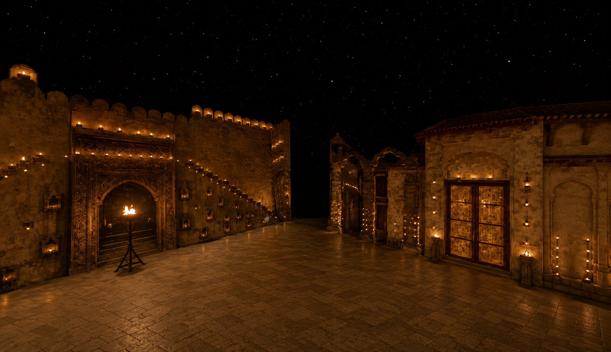
    </div>
    <figcaption style="font-size: 0.85em; text-align: center; color: #666; margin-top: 6px;"><strong>1 image</strong> — <code>songs_set/side_view.png</code></figcaption>
  </figure>
  <figure style="margin: 0;">
    <div style="aspect-ratio: 16/9; width: 100%; background: #111; border-radius: 6px; overflow: hidden; display: grid; grid-template-columns: repeat(3, 1fr); gap: 2px;">
      
      
      
    </div>
    <figcaption style="font-size: 0.85em; text-align: center; color: #666; margin-top: 6px;"><strong>~4 images</strong> — cardinal views from <code>pinga_set</code> stitch</figcaption>
  </figure>
</div>

---

### Panorama outputs — same next step, very different starting point

Both panoramas went through the **same HY-World 2.0 pipeline**. The difference is what went in.

<div style="display: grid; grid-template-columns: repeat(2, 1fr); gap: 16px; margin: 16px 0;">
  <figure style="margin: 0;">
    <div style="aspect-ratio: 2/1; width: 100%; background: #111; border-radius: 6px; overflow: hidden; display: flex; align-items: center; justify-content: center;">
      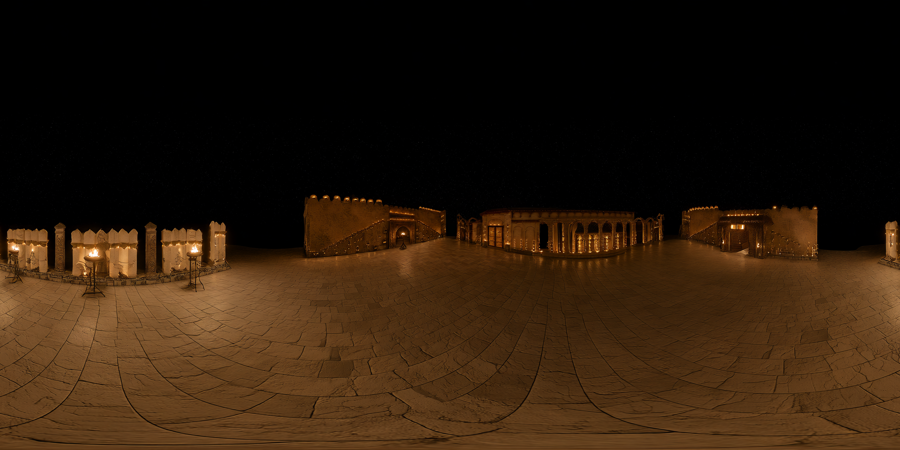
    </div>
    <figcaption style="font-size: 0.85em; text-align: center; color: #666; margin-top: 6px;">❌ <strong>1 image → HY-Pano 2.0</strong><br/><code>songs_set/panorama.png</code></figcaption>
  </figure>
  <figure style="margin: 0;">
    <div style="aspect-ratio: 2/1; width: 100%; background: #111; border-radius: 6px; overflow: hidden; display: flex; align-items: center; justify-content: center;">
      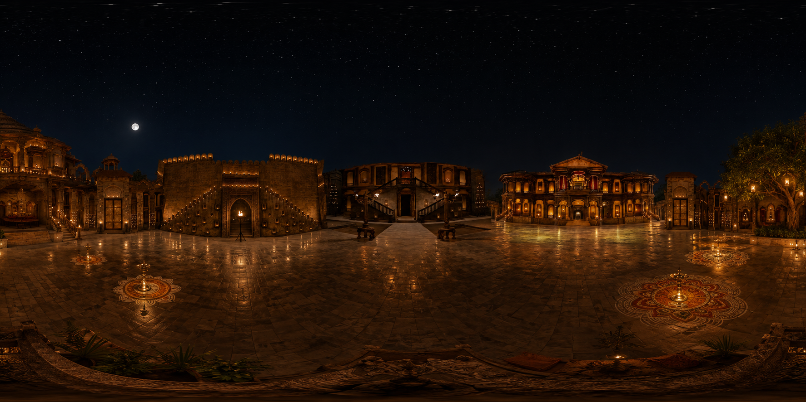
    </div>
    <figcaption style="font-size: 0.85em; text-align: center; color: #666; margin-top: 6px;">✅ <strong>4 sides → manual stitch</strong><br/><code>pinga_set/panorama.png</code></figcaption>
  </figure>
</div>

Look at the single-image panorama — it *looks* like a courtyard at first glance. But large sections were **never in the original frame**. HY-Pano invented the back wall, the opposite side, details that may not match other shots in the song. The 4-side version has **photographic evidence** behind each direction.

| | 1 image (HY-Pano) | ~4 images (custom stitch) |
|---|---|---|
| **What's real** | One viewing angle | Front, sides, back observed |
| **What's generated** | ~75% of the panorama | Only gaps between stitched views |
| **Geometry** | Depth guessed from hallucinations | Depth from MoGe on real frames |
| **Matches the song?** | Often contradicts other shots | Built from frames picked from the song |
| **Good for a quick test?** | Yes | — |
| **Good for set reconstruction?** | No — we abandoned this | Yes — this is what we used |

---

### It gets worse downstream

Same pipeline, same camera path (`view0/traj0`) — only the panorama input changed:

<div style="display: grid; grid-template-columns: repeat(2, 1fr); gap: 16px; margin: 16px 0;">
  <figure style="margin: 0;">
    <div style="aspect-ratio: 2/1; width: 100%; background: #111; border-radius: 6px; overflow: hidden; display: flex; align-items: center; justify-content: center;">
      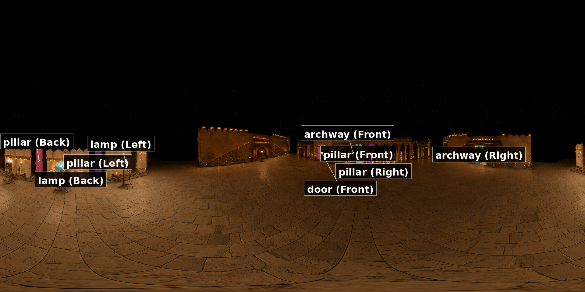
    </div>
    <figcaption style="font-size: 0.85em; text-align: center; color: #666; margin-top: 6px;">1 image → segmentation</figcaption>
  </figure>
  <figure style="margin: 0;">
    <div style="aspect-ratio: 2/1; width: 100%; background: #111; border-radius: 6px; overflow: hidden; display: flex; align-items: center; justify-content: center;">
      
    </div>
    <figcaption style="font-size: 0.85em; text-align: center; color: #666; margin-top: 6px;">4 images → segmentation</figcaption>
  </figure>
</div>

<div style="display: grid; grid-template-columns: repeat(2, 1fr); gap: 16px; margin: 16px 0;">
  <div>
    <p style="font-size: 0.9em; font-weight: 600; margin: 0 0 6px; text-align: center;">1 image → WorldStereo</p>
    <div style="aspect-ratio: 16/9; width: 100%; background: #111; border-radius: 6px; overflow: hidden;">
      <video src="media/09_panorama_comparison/single_worldstereo_view0.mp4" controls style="width: 100%; height: 100%; object-fit: contain;"></video>
    </div>
    <p style="font-size: 0.8em; color: #666; margin-top: 4px; text-align: center;"><code>songs_set/view0/traj0</code></p>
  </div>
  <div>
    <p style="font-size: 0.9em; font-weight: 600; margin: 0 0 6px; text-align: center;">4 images → WorldStereo</p>
    <div style="aspect-ratio: 16/9; width: 100%; background: #111; border-radius: 6px; overflow: hidden;">
      <video src="media/09_panorama_comparison/custom_worldstereo_view0.mp4" controls style="width: 100%; height: 100%; object-fit: contain;"></video>
    </div>
    <p style="font-size: 0.8em; color: #666; margin-top: 4px; text-align: center;"><code>pinga_set/view0/traj0</code></p>
  </div>
</div>

Garbage in, garbage out — but it **compounds**. A weak panorama poisons depth, mesh, trajectories, and every inpainted frame. That's the whole argument for the 4-side stitch. [Step 2](#step-2--building-the-panorama) walks through how we built it.

---

## Why we couldn't just run COLMAP or VGGT on the song

COLMAP and VGGT are great when you have a video where the camera **smoothly moves** through a space and consecutive frames overlap. A Bollywood song is the opposite of that.

We tried running **VGGT** on the raw Pinga song. Results were bad — no surprise. Shots don't overlap, cuts break correspondence, and half the frames are face close-ups. We abandoned that path.

COLMAP wasn't run on this scene either — there's no sparse reconstruction in `pinga_set`. Camera data comes from HY-World's own pipeline.

**Takeaway:** these tools aren't broken. They're just not meant to eat a full edited song without someone doing the hard work of picking the right frames first.

---

## Our actual approach (the "brute force" insight)

We stopped asking *"can AI reconstruct the whole song?"* and started asking *"what's the minimum set of good observations we need?"*

Here's the full pipeline, simplified:

```text
Movie song
  → pick ~4 useful frames by hand          (upstream)
  → generate wider horizontal views        (upstream)
  → stitch into a panorama + inpaint gaps  (upstream)
  → MoGe depth + manual point-cloud stitch (upstream)
  → HY-World 2.0 takes over from here      (pinga_set/)
      → depth + mesh + trajectories
      → render holes along camera paths
      → WorldStereo fills the holes
      → train 3D Gaussian Splatting
      → done (mostly)
```

The honest part: **humans pick the frames and verify the geometry**. Models handle the scale work after that. No single model does this end-to-end reliably on song footage.

---

## Step 1 — Picking the right frames (keyframes)

Automatic frame selection failed — too many cuts, too many actor shots. So we manually picked about **four complementary views** that together cover the courtyard from different angles.

In `pinga_set`, you see the result of that work as three view bins plus the panorama:

<div style="display: grid; grid-template-columns: repeat(3, 1fr); gap: 12px; margin: 16px 0;">
  <figure style="margin: 0;">
    
    <figcaption style="font-size: 0.85em; text-align: center; color: #666;">View 0</figcaption>
  </figure>
  <figure style="margin: 0;">
    
    <figcaption style="font-size: 0.85em; text-align: center; color: #666;">View 1</figcaption>
  </figure>
  <figure style="margin: 0;">
    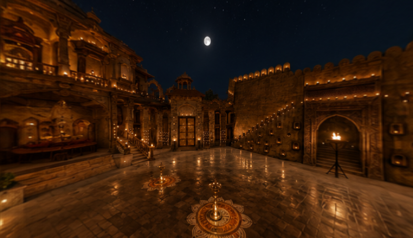
    <figcaption style="font-size: 0.85em; text-align: center; color: #666;">View 2</figcaption>
  </figure>
</div>

Each bin gets its own camera trajectories later. Unrelated song shots never get mixed together — that's the whole point of binning.

---

## Step 2 — Building the panorama

The comparison above showed *why* the 4-side stitch wins. This step is *how* we built it — the manual work before HY-World ever runs.

```text
~4 song frames  →  wider views  →  MoGe depth  →  manual PCD stitch  →  inpaint gaps  →  panorama.png
```

1. **Pick ~4 frames** from the song — each showing a different part of the courtyard (see [Step 1](#step-1--picking-the-right-frames-keyframes))
2. **Generate wider horizontal views** where the original framing was too tight or actor-centric
3. **Run MoGe v2** for dense metric depth on each view
4. **Stitch point clouds by hand** — we verified alignment ourselves instead of trusting automatic fusion
5. **Inpaint remaining gaps** in the stitched equirectangular panorama

The result is what HY-World actually consumed:

<div style="display: grid; grid-template-columns: 1fr; gap: 12px; margin: 16px 0;">
  <figure style="margin: 0;">
    <div style="aspect-ratio: 2/1; width: 100%; background: #111; border-radius: 6px; overflow: hidden; display: flex; align-items: center; justify-content: center;">
      
    </div>
    <figcaption style="font-size: 0.85em; text-align: center; color: #666; margin-top: 6px;">Final pipeline input — <code>pinga_set/panorama.png</code></figcaption>
  </figure>
</div>

The quick-test alternative — single frame through **HY-Pano 2.0** ([`code/panogen/`](code/panogen/)) — lives in [`songs_set/`](../songs_set/). Fine for prototyping; not what we used for the final reconstruction.

---

## Step 3 — HY-World samples views from the panorama

Once HY-World gets the panorama, Stage 1 (`traj_generate.py`) samples orbit and polar views to build depth banks and plan camera paths.

**Cardinal views** (used as reference frames for trajectories):

<div style="display: grid; grid-template-columns: repeat(3, 1fr); gap: 12px; margin: 16px 0;">
  <figure style="margin: 0;">
    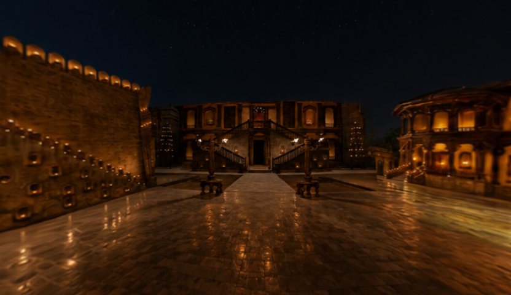
    <figcaption style="font-size: 0.85em; text-align: center; color: #666;">Cardinal 0</figcaption>
  </figure>
  <figure style="margin: 0;">
    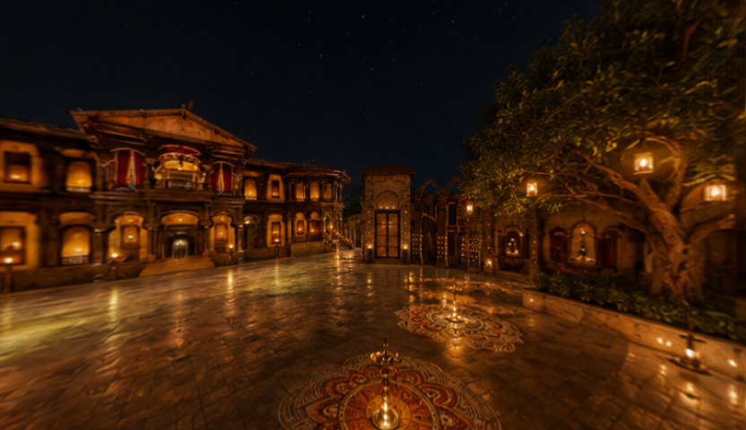
    <figcaption style="font-size: 0.85em; text-align: center; color: #666;">Cardinal 1</figcaption>
  </figure>
  <figure style="margin: 0;">
    
    <figcaption style="font-size: 0.85em; text-align: center; color: #666;">Cardinal 2</figcaption>
  </figure>
</div>

**Orbit + polar samples** (27 horizontal + 16 vertical views for depth coverage):

<div style="display: grid; grid-template-columns: repeat(4, 1fr); gap: 12px; margin: 16px 0;">
  <figure style="margin: 0;">
    
    <figcaption style="font-size: 0.85em; text-align: center; color: #666;">Orbit 0°</figcaption>
  </figure>
  <figure style="margin: 0;">
    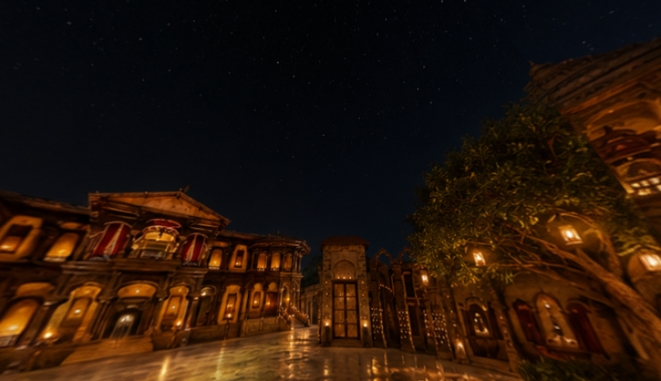
    <figcaption style="font-size: 0.85em; text-align: center; color: #666;">Orbit ~180°</figcaption>
  </figure>
  <figure style="margin: 0;">
    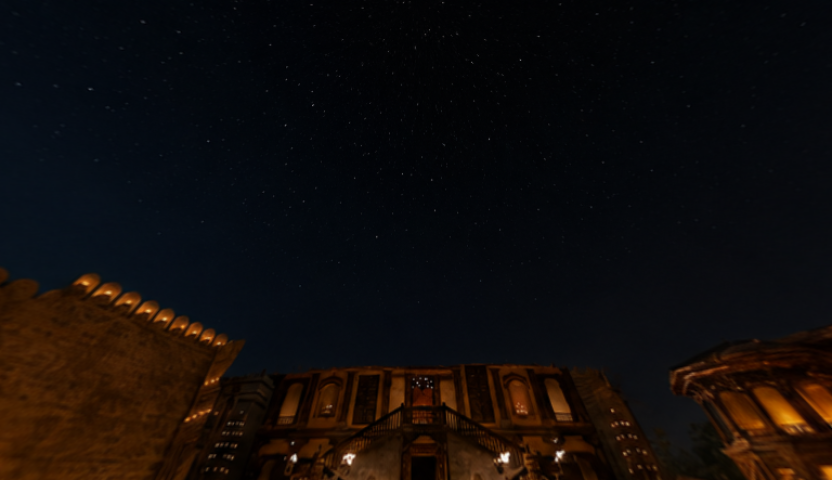
    <figcaption style="font-size: 0.85em; text-align: center; color: #666;">Polar up</figcaption>
  </figure>
  <figure style="margin: 0;">
    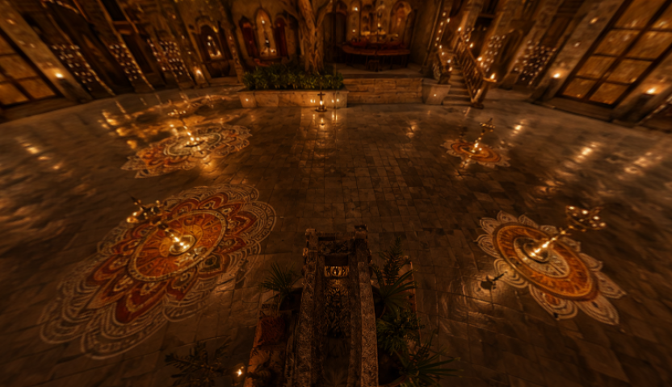
    <figcaption style="font-size: 0.85em; text-align: center; color: #666;">Polar down</figcaption>
  </figure>
</div>

From here HY-World also builds a mesh, detects objects, and plans **33 camera trajectories** across the scene.

---

## Step 4 — Understanding the scene (segmentation + masks)

HY-World runs a VLM to figure out what's in the scene — tree, pillars, benches, arches, etc. That drives object-targeted camera paths ("fly toward the tree").

<div style="display: grid; grid-template-columns: repeat(3, 1fr); gap: 12px; margin: 16px 0;">
  <figure style="margin: 0;">
    <div style="aspect-ratio: 2/1; width: 100%; background: #1a1a1a; border-radius: 6px; overflow: hidden; display: flex; align-items: center; justify-content: center;">
      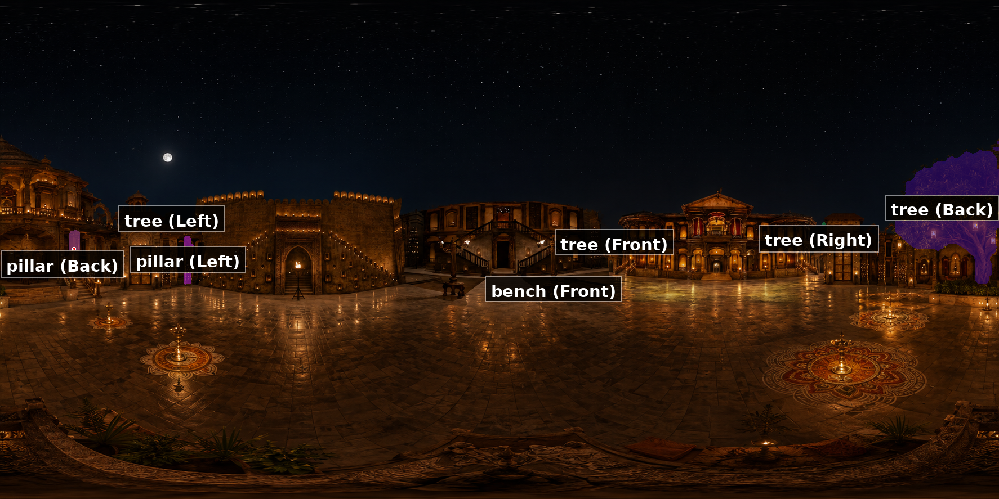
    </div>
    <figcaption style="font-size: 0.85em; text-align: center; color: #666; margin-top: 6px;">Segmentation (11 objects)</figcaption>
  </figure>
  <figure style="margin: 0;">
    <div style="aspect-ratio: 2/1; width: 100%; background: #1a1a1a; border-radius: 6px; overflow: hidden; display: flex; align-items: center; justify-content: center;">
      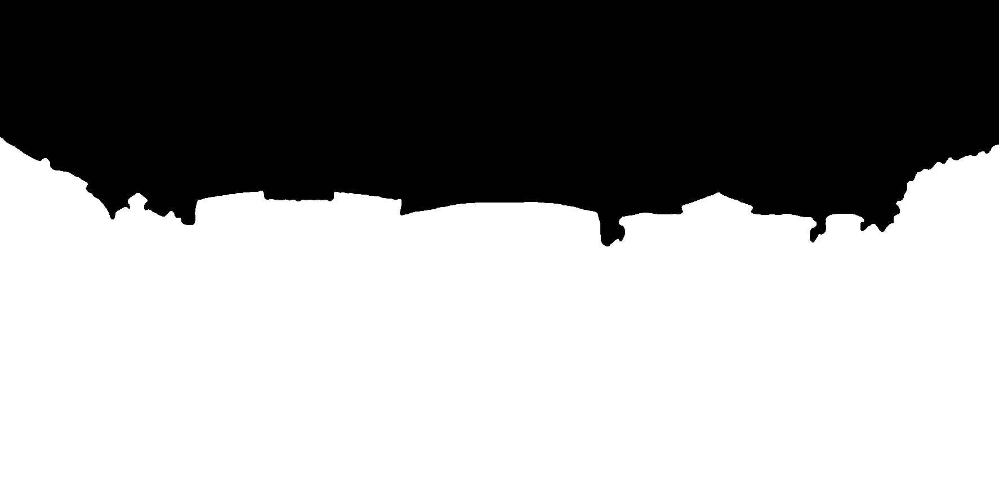
    </div>
    <figcaption style="font-size: 0.85em; text-align: center; color: #666; margin-top: 6px;">Sky mask</figcaption>
  </figure>
  <figure style="margin: 0;">
    <div style="aspect-ratio: 2/1; width: 100%; background: #1a1a1a; border-radius: 6px; overflow: hidden; display: flex; align-items: center; justify-content: center;">
      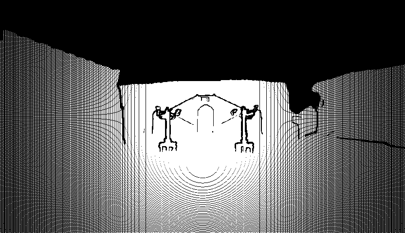
    </div>
    <figcaption style="font-size: 0.85em; text-align: center; color: #666; margin-top: 6px;">Valid geometry mask</figcaption>
  </figure>
</div>

Detected objects: tree, building, door, statue, bench, fence, lamp, sheds, staircase, pillar, trash can.

---

## Step 5 — Camera trajectories

Okay, so at this point we have a 3D mesh of the courtyard. That's great — but a mesh sitting in memory doesn't help us yet. What we actually need is **video**: a sequence of frames shot from many different camera positions, as if someone walked through the set with a camera.

Those paths — where the camera goes, which direction it looks, how many frames it captures — are **camera trajectories**. Every trajectory becomes a short clip (~21 frames) that gets rendered, inpainted, and eventually fed into 3DGS training.

For Pinga, HY-World planned **33 trajectories** total. Here's how that happened.

---

### Why not just make up random camera moves?

Random paths would miss important parts of the set, fly through walls, or stare at empty sky. HY-World instead:

1. Builds a **navmesh** — think of it like a walkable floor map in a video game. The camera can only move where the mesh says you can stand (the plaza floor, not inside a pillar).
2. Detects **objects** in the scene (tree, pillars, benches…) so paths can aim at interesting things.
3. Plans **different kinds of paths** for different purposes — a slow orbit around the tree vs. a wide exploration sweep vs. a simple pan from a known good viewpoint.

---

### Phase A — Simple pans from the panorama (`view0`, `view1`, `view2`)

Before any fancy navmesh planning, HY-World splits the input panorama into three cardinal views and generates **simple rotation paths** from each one. These are the most reliable trajectories because they start from **real image content** extracted directly from the panorama.

Each view bin gets up to 3 trajectories:

| Trajectory | Motion | What you'd see |
|---|---|---|
| `traj0` | Pan right (~120°) | Camera rotates right from the reference frame |
| `traj1` | Pan left (~120°) | Camera rotates left |
| `traj2` | Tilt up / aerial | Camera lifts and looks down slightly |

That's **9 trajectories** (3 views × 3 moves). Paths are checked against the mesh so the camera doesn't clip through geometry — if a rotation hits too many collisions, it gets discarded.

Each folder contains:
- `start_frame.png` — the first frame, sliced from the panorama (a **real** photo of the set)
- `camera.json` — 21 camera poses (position + rotation + intrinsics), one per frame
- Later: `render.mp4`, `render_mask.mp4`, `worldstereo-memory-dmd_result.mp4`

Downstream, WorldStereo conditions on each group's `start_frame.png` — for `view*`, that frame is a direct panorama slice at a fixed cardinal angle.

---

### Phase B — Finding objects to look at (VLM + SAM3)

For smarter paths, HY-World needs to know *what's in the scene*. This happens in `traj_generate.py` Stage 2:

```text
Panorama image
    ↓
Qwen3-VL (VLM) — "list the objects you'd navigate toward"
    ↓  →  objects.json (tree, pillar, bench, building, door…)
SAM3 segmentation — draw a mask around each object
    ↓  →  target_camera.json (2D/3D position, direction, size per object)
Navmesh path planning — compute routes on the walkable surface
```

For Pinga, the top-ranked object was the **tree** (score 0.92, direction: Back). Pillars and benches ranked next. Each object gets a 3D center point projected from the panorama depth — that's the "look at this" target for camera planning.

You saw the segmentation overlay back in Step 4. That same detection drives trajectory planning here.

---

### Phase C — Navmesh path planning (four modes)

Once the navmesh is built from `global_mesh.ply`, HY-World runs **Dijkstra pathfinding** from the scene origin and generates paths in four modes. Each mode answers a different question:

| Mode | Question it asks | Output folders | Count (Pinga) |
|---|---|---|---:|
| **Surround** | "Can we orbit around this object?" | `target_tree_0`, `target_pillar_1`… | 8 |
| **Exploration** | "What if we wander in 8 directions?" | `wonder_0`, `wonder_1`, `wonder_7` | 6 |
| **Reconstruct** | "Can we revisit under-covered areas?" | `reconstruct_1`, `reconstruct_3`… | 10 |
| **Target** | "Walk straight toward each object" | *(planned & saved, not rendered in this run)* | — |

**Naming quirk:** folders like `target_tree_0` come from **surround** mode (orbiting the tree), not "target" mode. Check `camera.json` — the `"type"` field says `"surround"`, `"exploration"`, or `"reconstruct"`.

Here's what each mode actually does:

**Surround (`target_*` folders)** — The camera walks a curved path **around** an object (tree, pillar, bench), always looking inward at its 3D center. The navmesh constrains the path to walkable ground.

**Exploration (`wonder_*` folders)** — The camera **wanders outward** along the farthest reachable node in each compass sector (8 sectors sampled, top 3 kept). Start frame is a panorama slice at the path's initial bearing.

**Reconstruct (`reconstruct_*` folders)** — Pairs of destinations from `navmesh/reconstruct_pairs.json`. **traj0** walks the navmesh to the target; **traj1** runs a small e-loop orbit at the endpoint. Filtered by FPS diversity (`recon_topk=5`).

After planning, duplicate or too-similar paths are dropped. Exploration keeps the 3 most diverse routes (`wonder_topk=3`). Surround paths are deduplicated against existing trajectories (`traj_sim_threshold`).

---

### What a trajectory actually contains

Every trajectory folder (regardless of type) ends up with the same structure:

```text
render_results/view0/traj0/
├── start_frame.png       ← first frame (conditioning image)
├── camera.json           ← 21 w2c poses + intrinsics
├── render.mp4            ← point-cloud splat video (Stage 2)
├── render_mask.mp4       ← white = holes to fill
├── worldstereo-memory-dmd_result.mp4  ← inpainted result (Stage 3)
├── traj_caption.json     ← VLM-written scene description
└── memory_inputs/        ← panorama references WorldStereo used
```

Each `camera.json` stores **21 frames** by default (`--nframe 21`). Frame 0 is the start pose; frames 1–20 interpolate smoothly along the path. Later, `traj_render.py` uses these poses to splat the point cloud into video, and the VLM writes a caption like:

> *"Under a star-dusted night sky, a grand courtyard is bathed in the warm, golden glow of countless lanterns… The camera slowly pans to the left…"*

That caption guides WorldStereo's video generation in the next step.

---

### The 33 trajectories — how sampling and path generation actually work

Pinga ends up with **33 trajectories** = **693 camera poses** (33 × 21 frames). All of this is produced inside `traj_generate.py` in two major stages. Below is the mechanical pipeline — what gets sampled, how paths are built, and how 3D waypoints become 21-frame videos.

**Inventory (output only):** 9 cardinal pans + 8 object orbits + 10 reconstruct paths + 6 exploration paths = 33, across 16 folder groups under `pinga_set/render_results/`.

<div style="display: grid; grid-template-columns: 1fr; gap: 12px; margin: 16px 0;">
  <figure style="margin: 0;">
    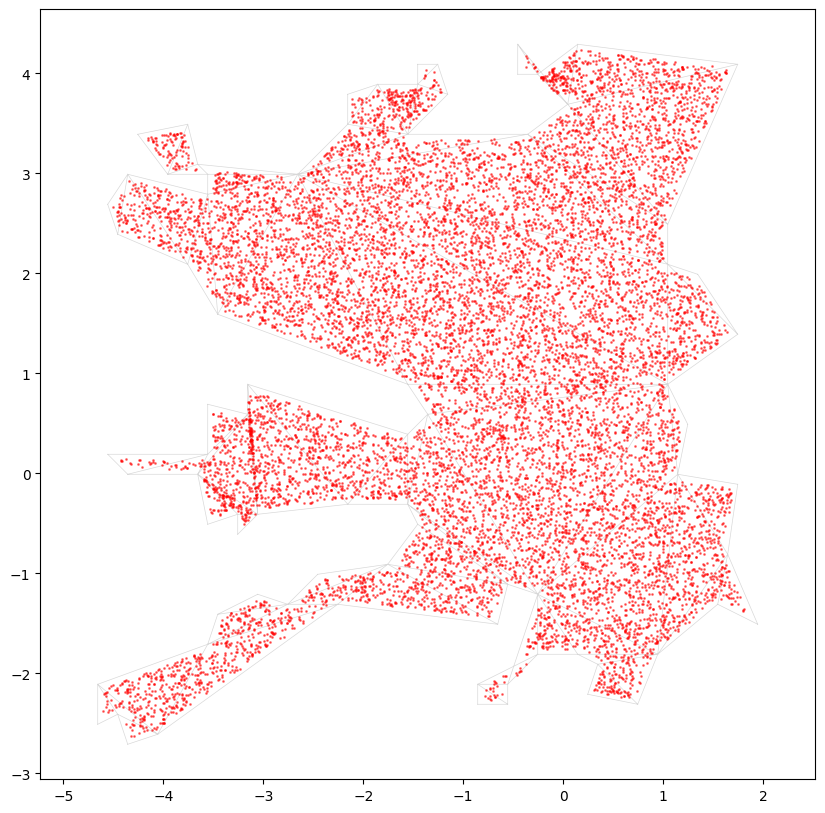
    <figcaption style="font-size: 0.85em; text-align: center; color: #666;">All planned paths visualized on the navmesh</figcaption>
  </figure>
</div>

---

#### Step 0 — Shared setup (before any trajectory exists)

From the input panorama, HY-World first builds shared scene geometry:

```text
panorama.png
  → MoGe depth prediction        → full_depth_prediction.pt
  → global point cloud + mesh    → global_pcd.ply, global_mesh.ply
  → pano_bank (27 orbit samples) → render_results/pano_bank/
  → polar_bank (16 elevation)    → render_results/polar_bank/
```

The **navmesh** is built from `global_mesh.ply` using Recast: mesh surface → walkable triangles → dense graph (`NavMeshGraph`, sample spacing 0.05 m). Every walking trajectory is constrained to this graph. The camera origin is `(0, 0, 0)`.

---

#### Stage A — Cardinal rotation trajectories (`view0`, `view1`, `view2`) · 9 paths

These are **not navmesh paths**. The camera stays at a fixed position and rotates.

**1. Panorama splitting (`split_view_num=3`)**

The equirectangular panorama is split into **3 horizontal look directions**, evenly spaced at 120°:

```text
view0 → look direction [-1, 0, 0]   (front)
view1 → rotated 120° around Z
view2 → rotated 240° around Z
```

For each split, HY-World:
- Renders a pinhole `start_frame.png` (832×480) via `split_panorama_image`
- Projects the global PCD into that view → `points.ply`, `point_mask.png`
- Stores the starting camera pose as `c2w_start`

**2. Rotation candidates (3 per view)**

For each view bin, three motion templates are applied via `get_c2w()`:

| traj | Template name | What it does |
|---|---|---|
| traj0 | `right-rotation` | Pan right, default 120° |
| traj1 | `left-rotation` | Pan left, default 120° |
| traj2 | `up-right-aerial` | Tilt up + slight right roll |

**3. Collision-aware interpolation**

`get_c2w()` does not blindly rotate. It:
- Interpolates `nframe - 1 = 20` intermediate poses toward the target rotation
- Queries a **KD-tree** on the global mesh at each step
- Counts obstruction iterations — if the camera would clip through geometry (`obs_iteration_limit`), the trajectory is **discarded**

**4. Output**

21 poses written to `view{i}/traj{j}/camera.json` as w2c extrinsics + shared intrinsics. Frame 0 = start pose; frames 1–20 = interpolated rotation.

→ **3 views × 3 rotations = 9 trajectories**

---

#### Stage B — Navmesh trajectories (VLM objects → 4 path modes) · 24 paths

**1. Object detection → 3D anchor points**

```text
Panorama → Qwen3-VL → object label list (objects.json)
         → SAM3     → per-object masks on the panorama
         → depth lift → 3D center_point_3d per object (target_camera.json)
```

Each detected object gets a 3D position, compass direction (Front/Back/Left/Right), and bearing angle on the panorama.

**2. Navmesh path planning (4 modes)**

From the origin node, Dijkstra distances are computed on the nav graph. Four path generators run:

| Mode | Function | What it samples | Saved to |
|---|---|---|---|
| **Exploration** | `explore_agents(8 directions)` | Farthest reachable node per 45° sector | `navmesh/exploration/paths.json` |
| **Surround** | `get_surround_paths_to_targets()` | Circular approach around each object's 3D center | `navmesh/surround/paths.json` |
| **Reconstruct** | `get_paths_to_targets()` on reconstruct pairs | Routes to under-covered regions from `reconstruct_pairs.json` | `navmesh/reconstruct/paths.json` |
| **Target** | `get_paths_to_targets()` | Direct approach paths toward objects | `navmesh/target/paths.json` |

Exploration sampling detail: the nav graph is divided into **8 angular sectors** around the origin. For each sector, the **farthest reachable node** is picked. Dijkstra predecessors are walked back to form a polyline of 3D waypoints. A `fix_start_direction()` pass trims backward-facing initial segments.

**3. Waypoints → 21 camera poses (`process_trajectories`)**

Every navmesh polyline goes through the same conversion:

```text
3D waypoint polyline
  → B-spline fit (smoothing 0.2–0.5, start point heavily weighted)
  → arc-length resample to nframe=21 uniformly spaced 3D points
  → optional path length clip (move_dist × median_depth)
  → build camera frame at each point:
        position  = sampled 3D point
        look-at   = object center (surround/reconstruct) OR path tangent (exploration)
        up vector = world Z
  → output: 21 c2w poses → saved as w2c in camera.json
```

For reconstruct paths, extra filters apply: backward motion > 120° and pitch > 45° can truncate or drop a path.

**4. Filtering before render**

Not every planned path becomes a trajectory folder:

| Mode | Filter | Pinga result |
|---|---|---|
| Exploration | Keep top-3 most diverse paths (`wonder_topk=3`) | 8 candidates → **3 groups** (`wonder_0`, `wonder_1`, `wonder_7`) |
| Surround | Drop trajectories too similar to existing ones (`traj_sim_threshold`) | **5 object groups**, 8 ground paths |
| Reconstruct | FPS diversity selection (`recon_topk=5`) | 10 pairs → **5 groups**, 10 paths |
| Target | Planned and saved to navmesh maps | **Not rendered** in this run |

**5. Start frame assignment for navmesh trajectories**

Unlike `view*` (fixed cardinal slice), navmesh groups get a **fresh panorama slice** at the trajectory's starting orientation:

```text
first pose w2c  →  split_panorama_image  →  {group}/start_frame.png
```

So each `target_*`, `reconstruct_*`, `wonder_*` folder has its own `start_frame.png` aligned to where that path begins.

**6. Optional second trajectory (`traj1`)**

Some groups get a **second variant**:

| Group type | traj0 | traj1 (if generated) |
|---|---|---|
| `view*` | ground rotation | — (traj2 is the aerial rotation, not a separate path) |
| `target_*` | ground surround orbit | aerial lift (`apply_up_route`, ~29° tilt) |
| `wonder_*` | ground exploration | aerial lift (~29°–45°) |
| `reconstruct_*` | navmesh approach | **e-loop** — small elliptical orbit at endpoint (`apply_recon_iteration`) |

---

#### Complete inventory — all 33 output trajectories

**Cardinal rotations (9)** — camera fixed, rotation only:

| Group | Traj | `camera.json` type |
|---|---|---|
| `view0/` | traj0, traj1, traj2 | `right-rotation`, `left-rotation`, `up-right-aerial` |
| `view1/` | traj0, traj1, traj2 | same three templates |
| `view2/` | traj0, traj1, traj2 | same three templates |

**Surround / object orbit (8)** — navmesh walk around VLM-detected object, `"type": "surround"`:

| Folder | Object (from `target_camera.json`) | Trajs |
|---|---|---|
| `target_tree_0/` | tree, Back | traj0 |
| `target_tree_4/` | tree, Right | traj0, traj1 (aerial) |
| `target_pillar_1/` | pillar, Left | traj0, traj1 (aerial) |
| `target_pillar_2/` | pillar, Back | traj0, traj1 (aerial) |
| `target_bench_3/` | bench, Front | traj0 |

**Reconstruct (10)** — navmesh walk to under-covered region, `"type": "reconstruct"`:

| Folder | Target (from `reconstruct_pairs.json`) | Trajs |
|---|---|---|
| `reconstruct_1/` | tree, Right | traj0 (approach), traj1 (e-loop) |
| `reconstruct_3/` | structural void | traj0, traj1 |
| `reconstruct_4/` | tree, Front | traj0, traj1 |
| `reconstruct_8/` | pillar, Back | traj0, traj1 |
| `reconstruct_9/` | pillar, Left | traj0, traj1 |

**Exploration (6)** — outward wander per compass sector, `"type": "exploration"`:

| Folder | Trajs |
|---|---|
| `wonder_0/` | traj0 (ground), traj1 (aerial) |
| `wonder_1/` | traj0 (ground), traj1 (aerial) |
| `wonder_7/` | traj0 (ground), traj1 (aerial) |

---

#### Navmesh maps — which planner produced which paths

<div style="display: grid; grid-template-columns: repeat(4, 1fr); gap: 12px; margin: 16px 0;">
  <figure style="margin: 0;">
    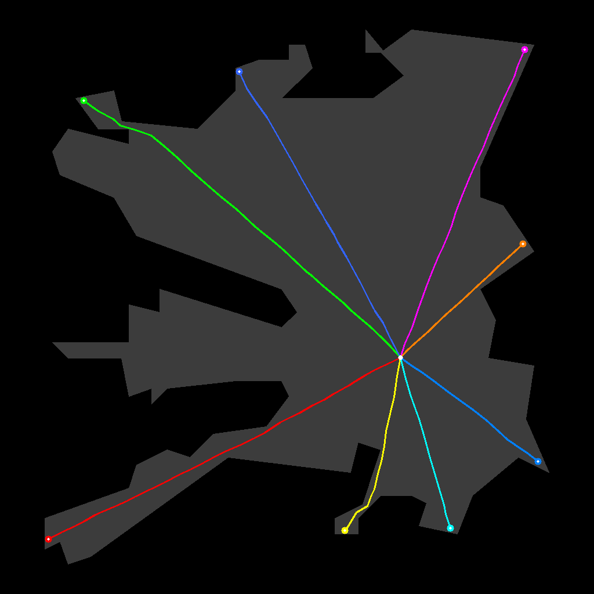
    <figcaption style="font-size: 0.85em; text-align: center; color: #666;"><strong>Explore</strong><br/>8 sectors → wonder_*</figcaption>
  </figure>
  <figure style="margin: 0;">
    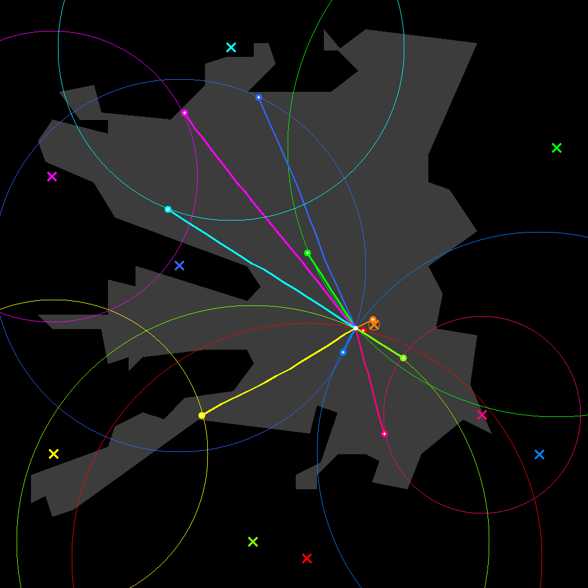
    <figcaption style="font-size: 0.85em; text-align: center; color: #666;"><strong>Reconstruct</strong><br/>reconstruct_*</figcaption>
  </figure>
  <figure style="margin: 0;">
    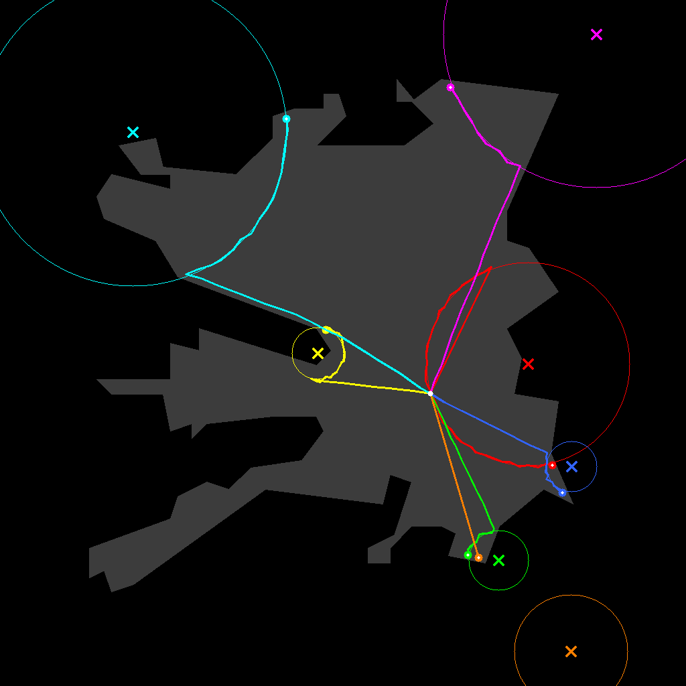
    <figcaption style="font-size: 0.85em; text-align: center; color: #666;"><strong>Surround</strong><br/>target_* folders</figcaption>
  </figure>
  <figure style="margin: 0;">
    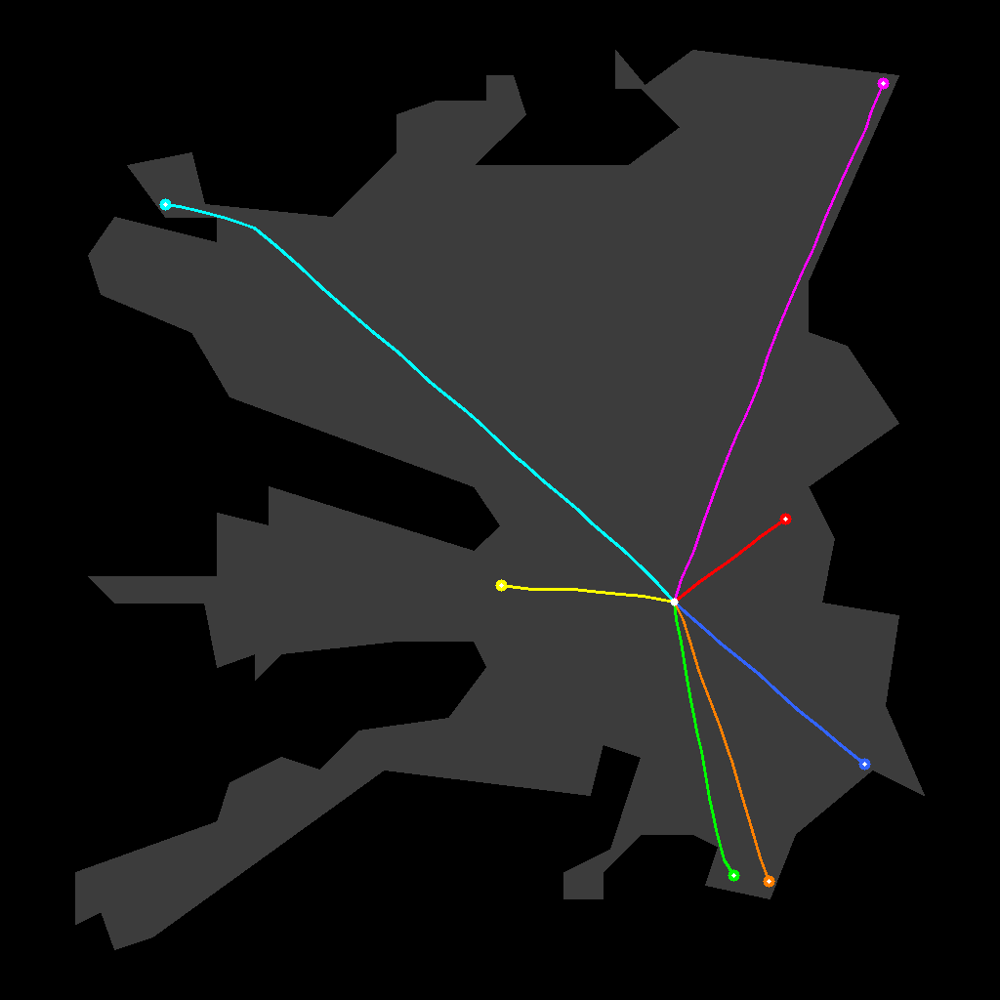
    <figcaption style="font-size: 0.85em; text-align: center; color: #666;"><strong>Target</strong><br/>planned, not rendered</figcaption>
  </figure>
</div>

Cardinal `view*` rotations do not use these maps — they are in-place rotations from fixed panorama splits.

---

#### After planning — what each trajectory folder contains

Every `{group}/traj{N}/` gets the same downstream artifacts once `traj_render.py` and `video_gen.py` run:

| File | Produced by | Contents |
|---|---|---|
| `camera.json` | `traj_generate.py` | 21 w2c poses + intrinsics |
| `{group}/start_frame.png` | `traj_generate.py` | Panorama slice at path start orientation |
| `traj_caption.json` | `traj_render.py` | VLM text description of the motion |
| `render.mp4` | `traj_render.py` | Point-splat render along the 21 poses |
| `render_mask.mp4` | `traj_render.py` | Per-pixel validity mask |
| `worldstereo-memory-dmd_result.mp4` | `video_gen.py` | Diffusion-completed video |

All poses are also aggregated into `render_results/cameras.glb` and `cameras_navi.glb` for 3D inspection.

**3DGS frame count:** 33 trajectories × 21 frames = 693, plus 54 pano_bank + 40 polar_bank = **787 images** in `gs_data/images/`.

Script: `code/stages/01_traj_generate.py` · Navmesh: `hyworld2/worldgen/src/navi_utils.py`

---

### How it all connects to the next step

Trajectories are the **bridge between geometry and video**:

```text
camera.json (21 poses)
    ↓  traj_render.py
render.mp4 + render_mask.mp4   ← gray holes where PCD is sparse
    ↓  video_gen.py (WorldStereo)
worldstereo-memory-dmd_result.mp4   ← inpainted video
    ↓  gen_gs_data.py
787 training frames for 3DGS
```

Each trajectory's 21 poses become one conditioning video, then one inpainted video, then extracted frames for 3DGS.

---

## Step 6 — Filling the holes (WorldStereo inpainting)

Here's where it gets visually interesting — and where things also break.

HY-World renders each camera path by splatting the point cloud into video frames. Problem: the point cloud is **sparse**. Large chunks of every frame are empty gray holes. A separate model called **WorldStereo** tries to fill those holes using the panorama as memory.

For each trajectory you get three files:

| File | What it is |
|---|---|
| `render.mp4` | Raw point-cloud render — gray = missing |
| `render_mask.mp4` | White = "please generate this", black = "keep as-is" |
| `worldstereo-memory-dmd_result.mp4` | Final output after diffusion |

### The good case — `view0` (cardinal view, real reference frame)

Watch these three side by side. Left = holes, middle = what needs filling, right = what WorldStereo produced:

<div style="display: grid; grid-template-columns: repeat(3, 1fr); gap: 12px; margin: 16px 0;">
  <div>
    <p style="font-size: 0.9em; font-weight: 600; margin: 0 0 6px;">① Raw render (holes expected)</p>
    <video src="media/07_inpainting/view0_render.mp4" controls style="width: 100%; border-radius: 6px;"></video>
  </div>
  <div>
    <p style="font-size: 0.9em; font-weight: 600; margin: 0 0 6px;">② Hole mask (white = missing)</p>
    <video src="media/07_inpainting/view0_render_mask.mp4" controls style="width: 100%; border-radius: 6px;"></video>
  </div>
  <div>
    <p style="font-size: 0.9em; font-weight: 600; margin: 0 0 6px;">③ WorldStereo result</p>
    <video src="media/07_inpainting/view0_worldstereo_result.mp4" controls style="width: 100%; border-radius: 6px;"></video>
  </div>
</div>

Not perfect, but the courtyard structure mostly holds.

### The bad case — `wonder_7` (exploration, PCD-only start frame)

Same three-way comparison. Notice how much more white is in the mask — the model has to invent almost the entire frame:

<div style="display: grid; grid-template-columns: repeat(3, 1fr); gap: 12px; margin: 16px 0;">
  <div>
    <p style="font-size: 0.9em; font-weight: 600; margin: 0 0 6px;">① Raw render</p>
    <video src="media/07_inpainting/wonder7_render.mp4" controls style="width: 100%; border-radius: 6px;"></video>
  </div>
  <div>
    <p style="font-size: 0.9em; font-weight: 600; margin: 0 0 6px;">② Hole mask (much bigger)</p>
    <video src="media/07_inpainting/wonder7_render_mask.mp4" controls style="width: 100%; border-radius: 6px;"></video>
  </div>
  <div>
    <p style="font-size: 0.9em; font-weight: 600; margin: 0 0 6px;">③ WorldStereo result (weaker)</p>
    <video src="media/07_inpainting/wonder7_worldstereo_result.mp4" controls style="width: 100%; border-radius: 6px;"></video>
  </div>
</div>

The mask file for `wonder_7` is ~2.7× larger than `view0`'s — that's 50–68% of pixels missing in many trajectories.

**Why holes remain:** WorldStereo treats the mask as soft guidance (ControlNet-style), not hard inpainting. It *suggests* where to generate but doesn't *force* replacement. Combined with sparse geometry and only four panorama memory views, some gray patches survive.

---

## Step 7 — Training the final 3D scene (3DGS)

WorldStereo outputs get fed into a **3D Gaussian Splatting** trainer — 787 frames, depth maps, normals, 8000 training steps. Output: a navigable radiance field you can render from any angle.

| Output | Size | What it is |
|---|---:|---|
| `global_mesh.ply` | 82 MB | Stage-1 mesh (primary mesh for now) |
| `point_cloud_7999.ply` | 123 MB | Trained 3DGS point cloud |
| `ckpt_7999_rank0.pt` | 171 MB | Training checkpoint |

Stage 6 (extract mesh from 3DGS checkpoint) wasn't run — `gs_output/mesh/` doesn't exist yet.

---

## The full pipeline at a glance

```text
┌─────────────────────┐
│     Movie Song      │
└──────────┬──────────┘
           ↓  (manual frame picking)
     ~4 keyframe views
           ↓  (stitch + inpaint)
     panorama.png  ← YOU ARE HERE for pinga_set input
           ↓
   HY-World Stage 1 ──→ mesh + depth + 33 trajectories
           ↓
   HY-World Stage 2 ──→ render.mp4 + render_mask.mp4
           ↓
   HY-World Stage 3 ──→ WorldStereo fills holes
           ↓
   HY-World Stage 4 ──→ 787 training frames
           ↓
   HY-World Stage 5 ──→ 3DGS checkpoint
           ↓
     Walkable 3D set 🎬
```

| Stage | Script | What happens |
|---|---|---|
| 1 | `traj_generate.py` | Depth, mesh, navmesh, trajectories |
| 2 | `traj_render.py` | Point-splat conditioning videos |
| 3 | `video_gen.py` | WorldStereo inpainting |
| 4 | `gen_gs_data.py` | Prepare 3DGS training data |
| 5 | `world_gs_trainer` | Train for 8000 steps |
| 6 | `extract_mesh.py` | *(not run yet)* |

Run it: `pinga_set/run_mesh_pipeline.sh` — see [`code/`](code/) for all scripts.

---

## What didn't work (honest list)

| Thing we tried | What happened |
|---|---|
| VGGT on raw song | Bad reconstruction — cuts kill correspondence |
| COLMAP on raw footage | Never ran — not suited without preprocessing |
| Single-frame HY-World | Would hallucinate most of the set |
| Raw PCD without panorama | Trajectories worked, inpainting quality was poor |
| WorldStereo on sparse trajectories | Holes remain — mask is soft guidance, not hard fill |
| DMD fast mode (4 denoising steps) | Fast but lower quality |
| Mesh extraction (Stage 6) | Not executed yet |

The pattern: every failure pushed us toward **better input preparation** rather than a bigger model.

---

## Results gallery

Everything below is real output from `pinga_set/`.

**Input → view bins → segmentation → trajectories:**

<div style="display: grid; grid-template-columns: repeat(2, 1fr); gap: 12px; margin: 16px 0;">
  <figure style="margin: 0;">
    
    <figcaption style="font-size: 0.85em; text-align: center; color: #666;">Input panorama</figcaption>
  </figure>
  <figure style="margin: 0;">
    
    <figcaption style="font-size: 0.85em; text-align: center; color: #666;">Object segmentation</figcaption>
  </figure>
</div>

<div style="display: grid; grid-template-columns: repeat(3, 1fr); gap: 12px; margin: 16px 0;">
  <figure style="margin: 0;">
    
    <figcaption style="font-size: 0.85em; text-align: center; color: #666;">View bin 0</figcaption>
  </figure>
  <figure style="margin: 0;">
    
    <figcaption style="font-size: 0.85em; text-align: center; color: #666;">View bin 1</figcaption>
  </figure>
  <figure style="margin: 0;">
    
    <figcaption style="font-size: 0.85em; text-align: center; color: #666;">View bin 2</figcaption>
  </figure>
</div>

**More trajectory results** — two other paths that worked reasonably well:

<div style="display: grid; grid-template-columns: repeat(2, 1fr); gap: 12px; margin: 16px 0;">
  <div>
    <p style="font-size: 0.9em; font-weight: 600; margin: 0 0 6px;">View1 — second cardinal bin</p>
    <video src="media/08_final/view1_worldstereo_result.mp4" controls style="width: 100%; border-radius: 6px;"></video>
  </div>
  <div>
    <p style="font-size: 0.9em; font-weight: 600; margin: 0 0 6px;">Target tree — VLM picked the tree, camera flies toward it</p>
    <video src="media/08_final/target_tree_worldstereo_result.mp4" controls style="width: 100%; border-radius: 6px;"></video>
  </div>
</div>

**3D assets** — open in MeshLab or CloudCompare:
- `media/08_final/global_mesh.ply` (82 MB)
- `media/08_final/point_cloud_7999.ply` (123 MB)

---

## What we learned

The hardest part wasn't picking a model. It was **designing a pipeline where each tool does one thing it's actually good at**:

- **Humans** pick frames and verify geometry (automation fails on song edits)
- **MoGe** gives dense depth (but needs good input views)
- **Manual PCD stitching** keeps alignment honest
- **HY-World 2.0** builds mesh + plans camera paths (but needs a good panorama)
- **WorldStereo** fills holes (but won't force-fill — soft guidance only)
- **3DGS** turns it all into a renderable scene

No single model eats a Bollywood song and spits out a 3D set. A chain of imperfect tools, with humans at the critical decision points, gets you most of the way there.

---

## Videos
### Side-by-side: good vs. bad inpainting

**View0 (good)** vs **Wonder7 (bad)** — final WorldStereo output:

<div style="display: grid; grid-template-columns: repeat(2, 1fr); gap: 12px; margin: 16px 0;">
  <div>
    <p style="font-size: 0.9em; font-weight: 600; margin: 0 0 6px;">✅ view0 — real reference frame, fewer holes</p>
    <video src="media/07_inpainting/view0_worldstereo_result.mp4" controls style="width: 100%; border-radius: 6px;"></video>
  </div>
  <div>
    <p style="font-size: 0.9em; font-weight: 600; margin: 0 0 6px;">⚠️ wonder_7 — PCD-only start, many holes remain</p>
    <video src="media/07_inpainting/wonder7_worldstereo_result.mp4" controls style="width: 100%; border-radius: 6px;"></video>
  </div>
</div>

---

## Checkpoints & models

Weights live in `pinga_set/` — symlinked under `media/checkpoints/` (not duplicated).

| Artifact | Path | Size | Used for |
|---|---|---:|---|
| Panorama depth | `render_results/full_depth_prediction.pt` | 100 MB | Stage 1 init |
| 3DGS checkpoint | `gs_output/ckpts/ckpt_7999_rank0.pt` | 171 MB | Final radiance field |
| Sky depth cache | `gs_output/sky_depth_cache.pt` | 522 MB | Training |
| Global mesh | `render_results/global_mesh.ply` | 82 MB | Navigation / rendering |
| 3DGS point cloud | `gs_output/ply/point_cloud_7999.ply` | 123 MB | Visualization |

External models (downloaded at runtime): Qwen3-VL-8B (trajectory planning), WorldStereo (inpainting), HunyuanWorld-Mirror (depth bank), MoGe v2 (upstream depth).

Training config: `pinga_set/gs_output/cfg.yml` · Pipeline runner: `code/run_mesh_pipeline.sh` · Panorama generator: `code/panogen/`

---

*All media from [`pinga_set/`](../pinga_set/). Code in [`code/`](code/). Raw movie frames and upstream keyframe picks aren't in this repo — only the HY-World pipeline outputs.*
